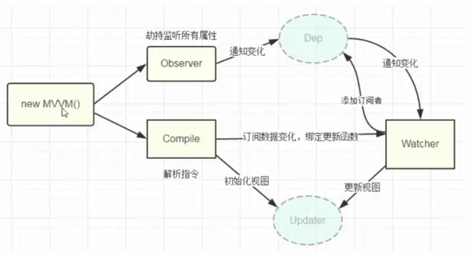
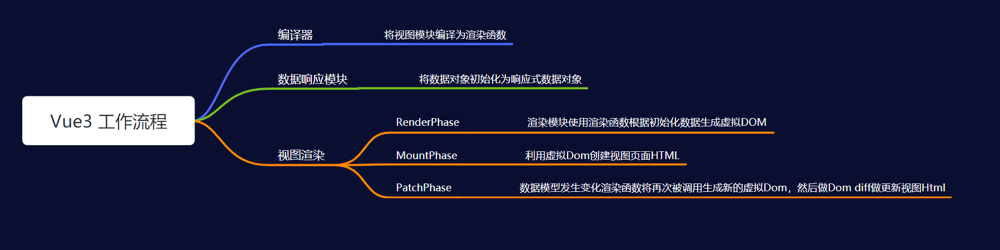

### 通过手写Vue简版代码理解Vue2 和 Vue3

### Vue2 

#### 思路
1. 不走虚拟DOM DOMdiff算法
2. 流程: 获取dom --->遍历子元素---> 编译节点 --->遍历属性 
  * 遍历的属性
    1. {{}}    处理插值
    2. e-text  处理textContent
    3. e-html  处理innerhtml
    4. e-model 处理input 监听什么的
    5. @开头的  绑定click事件

### Vue3 

#### 思路
1. 通过render函数代替编译器, 根据尤雨溪 简版教学 写数据响应模块和数据渲染模块